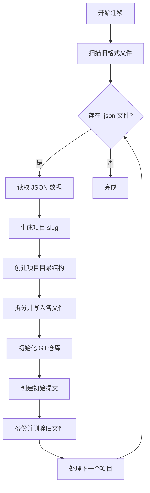

# 项目数据存储结构重构设计文档

## 1. 概述

### 1.1 背景

当前系统将每个项目的所有数据保存在单个 JSON 文件中，这种方式存在以下问题：

- **Git 版本控制困难**：单个大文件的变更难以追踪和合并
- **性能问题**：大型项目需要完整加载/保存整个文件
- **可读性差**：无法直接浏览项目内容
- **协作困难**：多人编辑容易产生冲突

### 1.2 目标

为每个项目建立独立目录结构，将不同类型的数据分离到独立文件中，以便于：

- Git 版本管理和差异比较
- 增量保存和加载
- 文件级别的协作和合并
- 更好的可读性和可维护性

## 2. 现有结构分析

### 2.1 当前存储结构

```
data/
└── users/
    └── {username}/
        └── projects/
            ├── {project-name-1}.json  # 所有数据在一个文件
            ├── {project-name-2}.json
            └── .git/                  # 可选：整个 projects 目录作为一个仓库
```

### 2.2 当前数据模型 (WorldData)

根据 [`types.ts`](../types.ts) 文件中的定义：

```typescript
interface WorldData {
  id?: string;
  name: string;
  frameworkId: string;
  createdAt: number;
  lastModified: number;
  context: string;                    // 世界背景描述
  model: WorldModel;                  // 核心世界模型
  storySegments: StorySegment[];      // 故事片段
  currentTimeSetting: string;
  chronicleText?: string;             // 编年史文本
  agents: StoryAgent[];               // AI代理定义
  workflow: WorkflowStep[];           // 工作流定义
  artifacts?: StoryArtifact[];        // 生成的产物
}

interface WorldModel {
  entities: SocialEntity[];           // 实体
  relationships: EntityRelationship[]; // 关系
  entityStates: EntityState[];        // 实体状态
  technologies: TechNode[];           // 技术节点
  techDependencies: TechDependency[]; // 技术依赖
}
```

## 3. 新目录结构设计

### 3.1 整体结构

```
data/
└── users/
    └── {username}/
        └── projects/
            └── {project-slug}/           # 每个项目独立目录
                ├── .git/                 # 独立 Git 仓库
                ├── project.json          # 项目元数据
                ├── context.md            # 世界背景 (Markdown)
                ├── chronicle.md          # 编年史 (Markdown)
                │
                ├── world/                # 世界模型数据
                │   ├── entities.json     # 所有实体
                │   ├── relationships.json # 所有关系
                │   ├── entity-states.json # 实体状态快照
                │   ├── technologies.json  # 技术树节点
                │   └── tech-dependencies.json # 技术依赖关系
                │
                ├── stories/              # 故事内容
                │   ├── _index.json       # 故事片段索引和元数据
                │   └── segments/         # 独立故事片段文件
                │       ├── {segment-id}.md
                │       └── ...
                │
                ├── artifacts/            # 生成的产物
                │   ├── _index.json       # 产物索引
                │   └── items/            # 独立产物文件
                │       ├── {artifact-id}.md
                │       ├── {artifact-id}.json
                │       └── ...
                │
                └── agents/               # AI代理配置
                    ├── agents.json       # Agent 定义
                    └── workflow.json     # 工作流配置
```

### 3.2 文件命名规范

- **项目目录名 (project-slug)**：基于项目名称生成，使用小写字母、数字和连字符
  - 例如：`三国演义世界` → `san-guo-yan-yi-shi-jie`
  - 内部保留原始名称在 `project.json` 中

- **故事片段文件**：使用 UUID 或时间戳作为文件名
  - 例如：`1702389600000.md` 或 `a1b2c3d4.md`

- **产物文件**：使用产物 ID 作为文件名，扩展名根据类型决定
  - text/markdown → `.md`
  - json → `.json`
  - code → `.txt` 或根据语言类型

## 4. 文件格式定义

### 4.1 project.json - 项目元数据

```json
{
  "version": "2.0",
  "id": "uuid-string",
  "name": "项目显示名称",
  "slug": "project-slug",
  "frameworkId": "framework-id",
  "currentTimeSetting": "2020年代",
  "createdAt": 1702389600000,
  "lastModified": 1702389600000
}
```

### 4.2 context.md - 世界背景

```markdown
# 世界背景

这里是世界的背景描述，使用 Markdown 格式...

## 设定基础

...

## 核心规则

...
```

### 4.3 chronicle.md - 编年史

```markdown
# 编年史

## 第一纪元

事件描述...

## 第二纪元

事件描述...
```

### 4.4 world/entities.json - 实体数据

```json
{
  "version": "1.0",
  "lastModified": 1702389600000,
  "entities": [
    {
      "id": "entity-uuid",
      "name": "实体名称",
      "description": "描述",
      "category": "person",
      "validFrom": "1900",
      "validTo": "2000"
    }
  ]
}
```

### 4.5 world/relationships.json - 关系数据

```json
{
  "version": "1.0",
  "lastModified": 1702389600000,
  "relationships": [
    {
      "id": "rel-uuid",
      "sourceId": "entity-1-id",
      "targetId": "entity-2-id",
      "type": "Friend",
      "description": "描述",
      "validFrom": "1920",
      "validTo": "1950"
    }
  ]
}
```

### 4.6 world/entity-states.json - 实体状态

```json
{
  "version": "1.0",
  "lastModified": 1702389600000,
  "entityStates": [
    {
      "id": "state-uuid",
      "entityId": "entity-uuid",
      "timestamp": "1920",
      "description": "状态描述"
    }
  ]
}
```

### 4.7 world/technologies.json - 技术节点

```json
{
  "version": "1.0",
  "lastModified": 1702389600000,
  "technologies": [
    {
      "id": "tech-uuid",
      "name": "技术名称",
      "description": "描述",
      "era": "Industrial Age",
      "type": "civil",
      "status": "production",
      "x": 100,
      "y": 200
    }
  ]
}
```

### 4.8 world/tech-dependencies.json - 技术依赖

```json
{
  "version": "1.0",
  "lastModified": 1702389600000,
  "dependencies": [
    {
      "id": "dep-uuid",
      "sourceId": "tech-1-id",
      "targetId": "tech-2-id"
    }
  ]
}
```

### 4.9 stories/_index.json - 故事索引

```json
{
  "version": "1.0",
  "lastModified": 1702389600000,
  "segments": [
    {
      "id": "segment-uuid",
      "timestamp": "1920年春",
      "influencedBy": ["entity-1-id", "entity-2-id"],
      "file": "segments/segment-uuid.md"
    }
  ]
}
```

### 4.10 stories/segments/{id}.md - 故事片段

```markdown
---
id: segment-uuid
timestamp: 1920年春
influencedBy:
  - entity-1-id
  - entity-2-id
---

# 故事标题

故事内容...
```

### 4.11 artifacts/_index.json - 产物索引

```json
{
  "version": "1.0",
  "lastModified": 1702389600000,
  "artifacts": [
    {
      "id": "artifact-uuid",
      "title": "产物标题",
      "type": "markdown",
      "sourceStepId": "step-uuid",
      "createdAt": 1702389600000,
      "file": "items/artifact-uuid.md"
    }
  ]
}
```

### 4.12 agents/agents.json - Agent 定义

```json
{
  "version": "1.0",
  "lastModified": 1702389600000,
  "agents": [
    {
      "id": "agent-uuid",
      "name": "历史学家",
      "role": "Historian",
      "systemPrompt": "你是一位专业的历史学家...",
      "color": "#4F46E5",
      "icon": "📚"
    }
  ]
}
```

### 4.13 agents/workflow.json - 工作流配置

```json
{
  "version": "1.0",
  "lastModified": 1702389600000,
  "steps": [
    {
      "id": "step-uuid",
      "name": "步骤名称",
      "agentId": "agent-uuid",
      "instruction": "执行指令",
      "outputArtifactType": "markdown",
      "validation": {
        "reviewerId": "reviewer-agent-id",
        "criteria": "审核标准",
        "maxRetries": 3
      }
    }
  ]
}
```

## 5. API 端点变更

### 5.1 现有 API 端点

| 方法 | 路径 | 描述 |
|------|------|------|
| GET | /api/worlds | 获取所有项目 |
| POST | /api/worlds | 保存项目 |
| DELETE | /api/worlds/:id | 删除项目 |
| POST | /api/git/init | 初始化 Git |
| GET | /api/git/status | 获取 Git 状态 |
| POST | /api/git/commit | 提交变更 |
| GET | /api/git/log | 获取历史 |

### 5.2 新增/修改 API 端点

#### 5.2.1 项目管理

| 方法 | 路径 | 描述 |
|------|------|------|
| GET | /api/v2/projects | 获取项目列表（只返回元数据） |
| POST | /api/v2/projects | 创建新项目 |
| GET | /api/v2/projects/:slug | 获取项目完整数据 |
| PUT | /api/v2/projects/:slug | 更新项目元数据 |
| DELETE | /api/v2/projects/:slug | 删除项目 |

#### 5.2.2 世界模型

| 方法 | 路径 | 描述 |
|------|------|------|
| GET | /api/v2/projects/:slug/world | 获取完整世界模型 |
| PUT | /api/v2/projects/:slug/world/entities | 更新实体 |
| PUT | /api/v2/projects/:slug/world/relationships | 更新关系 |
| PUT | /api/v2/projects/:slug/world/entity-states | 更新实体状态 |
| PUT | /api/v2/projects/:slug/world/technologies | 更新技术节点 |
| PUT | /api/v2/projects/:slug/world/tech-dependencies | 更新技术依赖 |

#### 5.2.3 内容文件

| 方法 | 路径 | 描述 |
|------|------|------|
| GET | /api/v2/projects/:slug/context | 获取世界背景 |
| PUT | /api/v2/projects/:slug/context | 更新世界背景 |
| GET | /api/v2/projects/:slug/chronicle | 获取编年史 |
| PUT | /api/v2/projects/:slug/chronicle | 更新编年史 |

#### 5.2.4 故事片段

| 方法 | 路径 | 描述 |
|------|------|------|
| GET | /api/v2/projects/:slug/stories | 获取故事索引 |
| POST | /api/v2/projects/:slug/stories | 创建故事片段 |
| GET | /api/v2/projects/:slug/stories/:id | 获取单个故事 |
| PUT | /api/v2/projects/:slug/stories/:id | 更新故事片段 |
| DELETE | /api/v2/projects/:slug/stories/:id | 删除故事片段 |

#### 5.2.5 产物管理

| 方法 | 路径 | 描述 |
|------|------|------|
| GET | /api/v2/projects/:slug/artifacts | 获取产物列表 |
| POST | /api/v2/projects/:slug/artifacts | 创建产物 |
| GET | /api/v2/projects/:slug/artifacts/:id | 获取单个产物 |
| PUT | /api/v2/projects/:slug/artifacts/:id | 更新产物 |
| DELETE | /api/v2/projects/:slug/artifacts/:id | 删除产物 |

#### 5.2.6 Agent 配置

| 方法 | 路径 | 描述 |
|------|------|------|
| GET | /api/v2/projects/:slug/agents | 获取 Agent 列表 |
| PUT | /api/v2/projects/:slug/agents | 更新 Agent 列表 |
| GET | /api/v2/projects/:slug/workflow | 获取工作流 |
| PUT | /api/v2/projects/:slug/workflow | 更新工作流 |

#### 5.2.7 Git 管理（项目级别）

| 方法 | 路径 | 描述 |
|------|------|------|
| POST | /api/v2/projects/:slug/git/init | 初始化项目 Git |
| GET | /api/v2/projects/:slug/git/status | 获取项目 Git 状态 |
| POST | /api/v2/projects/:slug/git/commit | 提交项目变更 |
| GET | /api/v2/projects/:slug/git/log | 获取项目历史 |
| GET | /api/v2/projects/:slug/git/diff/:hash | 查看特定提交差异 |
| POST | /api/v2/projects/:slug/git/checkout | 切换版本 |

### 5.3 API 响应格式

#### 成功响应

```json
{
  "success": true,
  "data": { ... }
}
```

#### 错误响应

```json
{
  "success": false,
  "error": {
    "code": "ERROR_CODE",
    "message": "错误描述"
  }
}
```

## 6. 前端变更

### 6.1 LocalStorageService.ts 重构

需要将 [`services/LocalStorageService.ts`](../services/LocalStorageService.ts) 改造为新的 [`ProjectService.ts`](../services/LocalStorageService.ts)：

```typescript
// services/ProjectService.ts

const API_BASE_URL = 'http://localhost:5001/api/v2';

// 项目管理
export const listProjects = async (): Promise<ProjectMeta[]> => { ... }
export const getProject = async (slug: string): Promise<WorldData> => { ... }
export const createProject = async (name: string, frameworkId: string): Promise<ProjectMeta> => { ... }
export const updateProject = async (slug: string, data: Partial<WorldData>): Promise<void> => { ... }
export const deleteProject = async (slug: string): Promise<void> => { ... }

// 世界模型
export const getWorldModel = async (slug: string): Promise<WorldModel> => { ... }
export const updateEntities = async (slug: string, entities: SocialEntity[]): Promise<void> => { ... }
export const updateRelationships = async (slug: string, rels: EntityRelationship[]): Promise<void> => { ... }
// ... 其他世界模型操作

// 内容文件
export const getContext = async (slug: string): Promise<string> => { ... }
export const updateContext = async (slug: string, content: string): Promise<void> => { ... }
export const getChronicle = async (slug: string): Promise<string> => { ... }
export const updateChronicle = async (slug: string, content: string): Promise<void> => { ... }

// 故事片段
export const listStories = async (slug: string): Promise<StorySegment[]> => { ... }
export const getStory = async (slug: string, id: string): Promise<StorySegment> => { ... }
export const createStory = async (slug: string, story: StorySegment): Promise<string> => { ... }
export const updateStory = async (slug: string, story: StorySegment): Promise<void> => { ... }
export const deleteStory = async (slug: string, id: string): Promise<void> => { ... }

// 产物
export const listArtifacts = async (slug: string): Promise<StoryArtifact[]> => { ... }
export const getArtifact = async (slug: string, id: string): Promise<StoryArtifact> => { ... }
export const createArtifact = async (slug: string, artifact: StoryArtifact): Promise<string> => { ... }
export const updateArtifact = async (slug: string, artifact: StoryArtifact): Promise<void> => { ... }
export const deleteArtifact = async (slug: string, id: string): Promise<void> => { ... }

// Agent 配置
export const getAgents = async (slug: string): Promise<StoryAgent[]> => { ... }
export const updateAgents = async (slug: string, agents: StoryAgent[]): Promise<void> => { ... }
export const getWorkflow = async (slug: string): Promise<WorkflowStep[]> => { ... }
export const updateWorkflow = async (slug: string, steps: WorkflowStep[]): Promise<void> => { ... }

// Git 操作
export const gitInit = async (slug: string): Promise<void> => { ... }
export const gitStatus = async (slug: string): Promise<GitStatus> => { ... }
export const gitCommit = async (slug: string, message: string): Promise<void> => { ... }
export const gitLog = async (slug: string): Promise<GitLog[]> => { ... }
```

### 6.2 状态管理更新

需要修改以下 hooks 以适应新的存储结构：

#### [`hooks/usePersistence.ts`](../hooks/usePersistence.ts)

- 添加当前项目 slug 状态
- 修改保存逻辑为增量保存
- 添加防抖保存机制

#### [`hooks/useWorldModel.ts`](../hooks/useWorldModel.ts)

- 修改为使用新的 API
- 实现局部更新而非全量保存

### 6.3 GitView.tsx 更新

修改 [`components/GitView.tsx`](../components/GitView.tsx)：

- 接收当前项目 slug 作为 props
- 调用项目级别的 Git API
- 显示当前项目的变更而非整个 projects 目录

### 6.4 新增类型定义

在 [`types.ts`](../types.ts) 中添加：

```typescript
// 项目元数据（轻量级，用于列表展示）
export interface ProjectMeta {
  id: string;
  name: string;
  slug: string;
  frameworkId: string;
  currentTimeSetting: string;
  createdAt: number;
  lastModified: number;
  hasGitRepo: boolean;
}

// Git 相关类型
export interface GitStatus {
  isRepo: boolean;
  branch: string;
  changes: GitChange[];
}

export interface GitChange {
  status: 'M' | 'A' | 'D' | '??' | 'R';
  path: string;
  staged: boolean;
}

export interface GitLog {
  hash: string;
  author: string;
  message: string;
  date: string;
  files: string[];
}
```

## 7. 数据迁移策略

### 7.1 迁移流程



### 7.2 迁移脚本设计

创建 `scripts/migrate-v2.js`：

```javascript
#!/usr/bin/env node
import fs from 'fs';
import path from 'path';
import { exec } from 'child_process';
import { promisify } from 'util';

const execAsync = promisify(exec);

async function migrateProject(oldFilePath, projectsDir) {
  // 1. 读取旧数据
  const oldData = JSON.parse(fs.readFileSync(oldFilePath, 'utf8'));
  
  // 2. 生成 slug
  const slug = generateSlug(oldData.name);
  const projectDir = path.join(projectsDir, slug);
  
  // 3. 创建目录结构
  fs.mkdirSync(path.join(projectDir, 'world'), { recursive: true });
  fs.mkdirSync(path.join(projectDir, 'stories', 'segments'), { recursive: true });
  fs.mkdirSync(path.join(projectDir, 'artifacts', 'items'), { recursive: true });
  fs.mkdirSync(path.join(projectDir, 'agents'), { recursive: true });
  
  // 4. 写入 project.json
  writeProjectMeta(projectDir, oldData);
  
  // 5. 写入 context.md 和 chronicle.md
  writeMarkdownFiles(projectDir, oldData);
  
  // 6. 写入世界模型文件
  writeWorldModel(projectDir, oldData.model);
  
  // 7. 写入故事片段
  writeStories(projectDir, oldData.storySegments);
  
  // 8. 写入产物
  writeArtifacts(projectDir, oldData.artifacts || []);
  
  // 9. 写入 Agent 配置
  writeAgentConfig(projectDir, oldData.agents, oldData.workflow);
  
  // 10. 初始化 Git
  await execAsync('git init', { cwd: projectDir });
  await execAsync('git add .', { cwd: projectDir });
  await execAsync(`git commit -m "Migrated from v1"`, { cwd: projectDir });
  
  // 11. 备份旧文件
  const backupPath = oldFilePath.replace('.json', '.v1.backup.json');
  fs.renameSync(oldFilePath, backupPath);
  
  console.log(`Migrated: ${oldData.name} -> ${slug}`);
}

async function migrateAll(usersDir) {
  const users = fs.readdirSync(usersDir);
  
  for (const user of users) {
    const projectsDir = path.join(usersDir, user, 'projects');
    if (!fs.existsSync(projectsDir)) continue;
    
    const files = fs.readdirSync(projectsDir)
      .filter(f => f.endsWith('.json') && !f.includes('.backup'));
    
    for (const file of files) {
      await migrateProject(
        path.join(projectsDir, file),
        projectsDir
      );
    }
  }
}
```

### 7.3 迁移命令

```bash
# 运行迁移
npm run migrate:v2

# 或手动执行
node scripts/migrate-v2.js
```

### 7.4 回滚策略

迁移过程中保留 `.v1.backup.json` 文件，如果需要回滚：

```bash
# 回滚单个项目
node scripts/rollback-v2.js --project <slug>

# 回滚所有项目
node scripts/rollback-v2.js --all
```

## 8. 兼容性处理

### 8.1 API 版本兼容

- 保留 `/api/worlds` 旧 API 一段时间
- 新 API 使用 `/api/v2` 前缀
- 前端根据项目格式自动选择 API

### 8.2 自动检测项目格式

```typescript
async function detectProjectFormat(projectPath: string): Promise<'v1' | 'v2'> {
  if (fs.existsSync(path.join(projectPath, 'project.json'))) {
    return 'v2';
  }
  if (projectPath.endsWith('.json')) {
    return 'v1';
  }
  throw new Error('Unknown project format');
}
```

### 8.3 在线迁移

用户打开旧格式项目时，提供迁移选项：

```typescript
// App.tsx 或 WorldLoader 组件中
if (projectFormat === 'v1') {
  showMigrationDialog({
    title: '项目格式升级',
    message: '检测到旧格式项目，是否升级到新格式？升级后可获得更好的版本控制体验。',
    onConfirm: () => migrateProject(projectId),
    onCancel: () => openInLegacyMode(projectId)
  });
}
```

## 9. 实现计划

### Phase 1: 后端重构

1. 创建新的文件操作工具函数
2. 实现 `/api/v2/projects` 基础 CRUD
3. 实现世界模型分文件存储
4. 实现故事和产物分文件存储
5. 实现项目级 Git 操作

### Phase 2: 前端适配

1. 创建新的 ProjectService
2. 更新状态管理 hooks
3. 修改 GitView 组件
4. 添加迁移提示 UI

### Phase 3: 迁移工具

1. 开发迁移脚本
2. 测试迁移流程
3. 开发回滚脚本
4. 编写迁移文档

### Phase 4: 测试和上线

1. 单元测试
2. 集成测试
3. 性能测试
4. 灰度发布

## 10. 风险与注意事项

### 10.1 数据安全

- 迁移前自动备份
- 保留旧文件直到确认新格式正常
- 提供回滚机制

### 10.2 性能考虑

- 首次加载需要读取多个文件（可并行读取）
- 保存时只更新变更的文件（大幅减少 IO）
- 考虑添加缓存层

### 10.3 Git 仓库大小

- 故事片段使用 Markdown，便于差异比较
- 避免在仓库中存储二进制文件
- 考虑添加 `.gitignore` 排除临时文件

### 10.4 并发安全

- 添加文件锁机制防止并发写入冲突
- 考虑使用乐观锁（版本号检查）

## 11. 附录

### 11.1 Slug 生成算法

```typescript
function generateSlug(name: string): string {
  // 移除特殊字符
  let slug = name
    .toLowerCase()
    .replace(/[<>:"/\\|?*]/g, '')
    .replace(/\s+/g, '-')
    .replace(/-+/g, '-')
    .substring(0, 50);
  
  // 如果是中文，使用 pinyin 转换（需要 pinyin 库）
  // 或者使用 base64 编码
  if (/[\u4e00-\u9fa5]/.test(slug)) {
    slug = Buffer.from(name).toString('base64url').substring(0, 20);
  }
  
  return slug || 'untitled-project';
}
```

### 11.2 .gitignore 模板

```gitignore
# 临时文件
*.tmp
*.bak
.DS_Store

# 编辑器锁文件
*.lock

# 日志文件
*.log
```

### 11.3 示例项目结构

```
三体世界/
├── .git/
├── .gitignore
├── project.json
├── context.md
├── chronicle.md
├── world/
│   ├── entities.json      # 3 个实体
│   ├── relationships.json # 2 个关系
│   ├── entity-states.json # 5 个状态
│   ├── technologies.json  # 10 个技术
│   └── tech-dependencies.json
├── stories/
│   ├── _index.json
│   └── segments/
│       ├── chapter-1.md
│       ├── chapter-2.md
│       └── chapter-3.md
├── artifacts/
│   ├── _index.json
│   └── items/
│       ├── outline.md
│       └── character-bios.md
└── agents/
    ├── agents.json
    └── workflow.json
```
